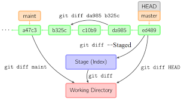

# Comandos básicos en local.
Escribe los comandos según su descripción:

### 1. ¿Cómo transformo el directorio actual en un repositorio de Git?
```bash
git init
```

---

### 2. ¿Cómo especifico qué archivos quiero añadir al repositorio (staging area)?
```bash
git add <archivo>     # Añadir archivo específico
git add .             # Añadir todos los archivos del directorio actual
```

---

### 3. ¿Cómo confirmo los cambios (commit)?
```bash
git commit -m "Mensaje descriptivo del commit"
```

---

### 4. ¿Cómo clono un repositorio existente?
```bash
git clone <URL-del-repositorio>
```

---

### 5. ¿Cómo muestro el estado de los archivos?
```bash
git status
```

---

### 6. ¿Cómo muestro el estado abreviado?
```bash
git status -s
```

---

### 7. ¿Cómo ignoro archivos para que Git no los rastree?
Crea un archivo `.gitignore` y añade los patrones a ignorar. Ejemplo:
```
*.log
node_modules/
secret.txt
```

---

### 8. ¿Cómo muestro los cambios no preparados vs lo que está en staging?
```bash
git diff
```

---

### 9. ¿Cómo muestro los cambios preparados vs el último commit?
```bash
git diff --cached
```

---

### 10. ¿Cómo confirmo cambios sin pasar por el área de preparación?
```bash
git commit -am "Mensaje del commit"
```
> Solo para archivos que ya estaban siendo rastreados.

---

### 11. ¿Cómo elimino archivos del directorio de trabajo y del área de preparación?
```bash
git rm <archivo>
```

---

### 12. ¿Cómo renombro archivos del directorio de trabajo y del área de preparación?
```bash
git mv <archivo_viejo> <archivo_nuevo>
```

---

### 13. ¿Cómo muestro el historial de confirmaciones?
```bash
git log
```

---

### 14. ¿Cómo muestro las dos últimas confirmaciones con diferencias?
```bash
git log -p -2
```

---

### 15. ¿Cómo rectifico el último commit?
```bash
git commit --amend
```

---

### 16. ¿Cómo deshago un archivo preparado (staged)?
```bash
git restore --staged <archivo>
```

---

### 17. ¿Cómo deshago un archivo modificado (descarta cambios, peligroso)?
```bash
git restore <archivo>
```



## De interés
- [2.1 Fundamentos de Git - Obteniendo un repositorio Git](https://git-scm.com/book/es/v2/Fundamentos-de-Git-Obteniendo-un-repositorio-Git)
- [2.2 Fundamentos de Git - Guardando cambios en el Repositorio](https://git-scm.com/book/es/v2/Fundamentos-de-Git-Guardando-cambios-en-el-Repositorio)
- [gitignore](https://github.com/github/gitignore/blob/main/Java.gitignore)
- [2.4 Fundamentos de Git - Deshacer Cosas](https://git-scm.com/book/es/v2/Fundamentos-de-Git-Deshacer-Cosas)
